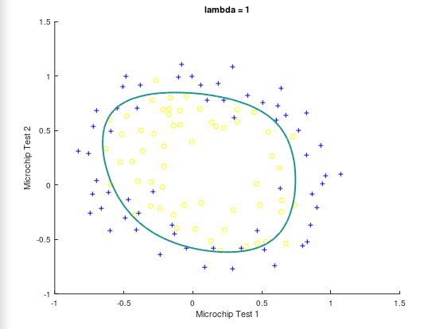

# Logistic Regression Admissions
 Logistic regression and regularized logistic regression are used to determine the chance a student gets into a university based on test scores. Running ex2.m runs the logistic regression version and running ex2_reg.m runs the regularized version.

##### Logistic Regression Prediction

##### Regularized Logistic Regression Prediction
